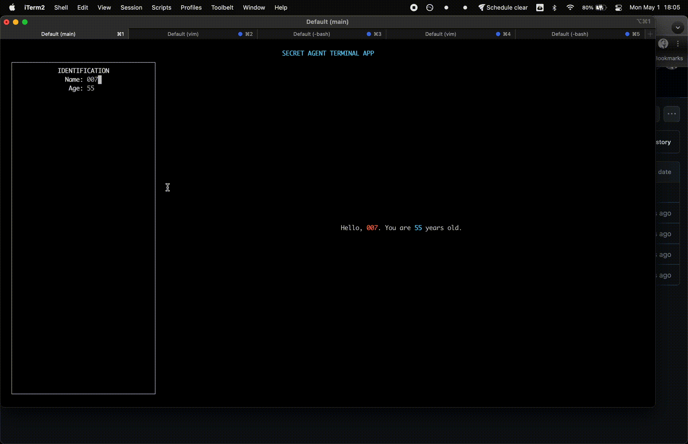

Secret Agent Terminal
=====================
This demo shows off some of what can be done with Teact. 

You can interact with the app by:

1. Typing or deleting to change the text in a field
1. Pressing `TAB` to cycle between the fields
1. Resizing the window so that it reflows (try with a very small terminal size)
